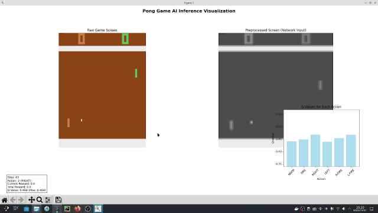

# next_RL

## 演示

*使用DQN算法进行"PongNoFrameskip-v4"游戏的训练结果展示*

## V1.0版本

__在V1.0版本中，初步实现了基于Pong游戏的DQN的模型训练、搭建以及推理可视化等__

__在V1.0版本中，初步实现了基于Pong游戏的PPO的模型训练、搭建以及推理可视化等__

__在V1.0版本中，初步实现了基于Pong游戏的A3C的模型训练、搭建以及推理可视化等__

__关于V1.0版本的DQN、PPO与A3C文件夹下的程序的运行，需要以下的配置哦！__

*创建独立的python虚拟环境*

    conda create -n next_test_RL python=3.11

*配置pytorch+cuda的环境*

    pip3 install torch torchvision --index-url https://download.pytorch.org/whl/cu126

*配置gymnasium强化学习环境*

    pip install gymnasium==0.28.1
    pip install gym==0.26.2
    pip install AutoROM==0.4.2
    pip install "gymnasium[atari,accept-rom-license]"
    pip install "autorom[accept-rom-license]"
    pip install grpcio==1.76.0
    pip install gym-notices==0.1.0

*配置其它的依赖包*

    pip install Pillow matplotlib
    pip install opencv-python
    pip install imageio
    pip install imageio-ffmpeg
    pip install moviepy
    pip install psutil
    pip install tqdm
    pip install pandas
    pip install requests
    pip install ale-py==0.8.1
    pip install protobuf
    pip install tensorboard

如果你使用的Linux系统，还是配置更加丰富的环境依赖

    sudo apt-get update
    sudo apt-get install swig
    pip install box2d-py
    pip install gymnasium[box2d]
    conda install -c conda-forge libstdcxx-ng

*如若上述命令直接使用的过程中，安装不够通畅，则可像下面这样加上清华源进行安装*

    pip install -i https://pypi.tuna.tsinghua.edu.cn/simple gymnasium[box2d]

配置成功上述所列的环境与依赖后，即可来到DQN、PPO或A3C文件夹下运行训练或推理程序了

## V1.1版本

__在V1.1版本中关于DQN、PPO与A3C的运行环境依然是沿用V1.0版本下的环境配置，若想运行V1.1版本下的这三种算法__

__的程序文件，就按照上面V1.0版本的环境配置进行配置即可成功运行程序，只是在V1.1版本中这三种算法对应的项目文件结构__

__有所变化。同时在PPO算法逻辑下还有加入了Actor-Critic的算法思想。__

## V1.2版本
    
__关于V1.2版本的概要: 综合了先前V1.0与V1.1版本的全部内容，从真正意义上完全亲手构建与理解强化学习的模型架构。__

__实现了DQN、A3C、PPO、DDPG、SAC的这五个强化学习模型的架构与训练、推理可视化的算法逻辑等。__

__注意:对于V1.2版本的环境搭建，仍然沿用V1.0版本中的说明即可。__

### 关于本项目中的DQN实现的说明
    
在V1.2版本中实现的DQN网络的详细说明如下

此版本中的DQN采用改进的ResNet(残差网络)架构，专门设计用于处理图像输入的环境。该网络能够从像素数据中自动学习特征表示，并输出每个可能动作的Q值（动作价值函数）。

核心组件

*1、残差块*

残差块是ResNet的核心构建模块，解决了深度神经网络中的梯度消失问题：

    主路径：两个3x3卷积层，每个卷积层后接批归一化(VatchNorm)和ReLU激活
    快捷连接：当输入输出维度不匹配时，使用1x1卷积调整维度
    残差连接：将主路径输出与快捷连接输出相加，确保梯度能够直接反向传播

这种设计让网络能够轻松训练很深的架构，而不担心梯度消失

*2、网络层次结构*
网络采用分层设计，逐步提取抽象特征：

    1、初始卷积层：
        输入：原始图像状态（如84x84像素）
        操作：3x3卷积，64个滤波器，保持空间尺寸
        输出：64通道的特征图
    2、残差层1(2个残差块)：
        输入输出：64通道，84x84分辨率
        作用：学习基础视觉特征
    3、残差层2（2个残差块）：
        输入：64通道 ---> 输出： 128通道
        空间下采样：84x84 ---> 42x42
        作用：提取中级特征
    4、残差层3（2个残差块）：
        输入：128通道 ---> 输出：256通道
        空间下采样：42x42 ---> 21x21
        作用：学习高级语义特征
    5、残差层4（2个残差块）：
        输入：25通道 ---> 输出：512通道
        空间下采样：21x21 ---> 11x11
        作用：提取全局上下文信息
    6、输出层
        全局平均池化：将任意尺寸特征图压缩为1x1
        全连接层：512维特征向量 ---> 动作数量的Q值输出

DQNAgent采用双网络设计

智能体采用经典DQN的双网络架构：

    策略网络（Policy Network）：用于选择动作，每个训练步骤都会更新
    目标网络（Target Network）：用于计算目标Q值，定期从策略网络同步参数
    这种设计显著提高了训练稳定性，防止Q值估计的振荡

*3、关于核心算法的说明*
    
    1、epsilon-贪婪动作选择
        智能体在探索与利用之间智能平衡
            # epsilon随时间指数衰减
            epsilon = final_epsilon + (initial_epsilon - final_epsilon) x exp(-steps / decay_steps)
        ---高epsilon阶段:早期训练，优先探索环境，发现有益行为
        ---低epsilon阶段：后期训练，主要利用学到的策略，获得更高回报

    2、经验回放训练
        从经验缓冲区随机采样，打破数据相关性：
            ---采样经验：随机选择一批(state, action, reward, next_state, done)元组
            ---计算当前Q值：策略网络对当前状态的预测
            ---计算目标Q值：目标网络对下一状态的预测，结合实际奖励
            ---优化损失：最小化当前Q值与目标Q值之间的差距

    3、目标Q值计算
        采用时间差分（Temporal Difference）学习;
            目标Q值 = 即时奖励 + 折扣因子 × 下一状态最大Q值 × (1 - 终止标志)

    4、损失函数
        使用Huber损失（平滑L1损失），对异常值更鲁棒：
            ---对小误差使用平方损失，提供平滑梯度
            ---对大误差使用线性损失，防止梯度爆炸

    5、梯度裁剪
        限制梯度范数不超过10.0，防止训练不稳定和梯度爆炸。

### 关于本项目中的A3C实现的说明

### 关于本项目中的PPO实现的说明

### 关于本项目中的DDPG实现的说明

### 关于本项目中的SAC实现的说明

*如果你是英伟达显卡，可以使用如下的命令实时监控显存的使用情况*

*watch -n 2 nvidia-smi*

