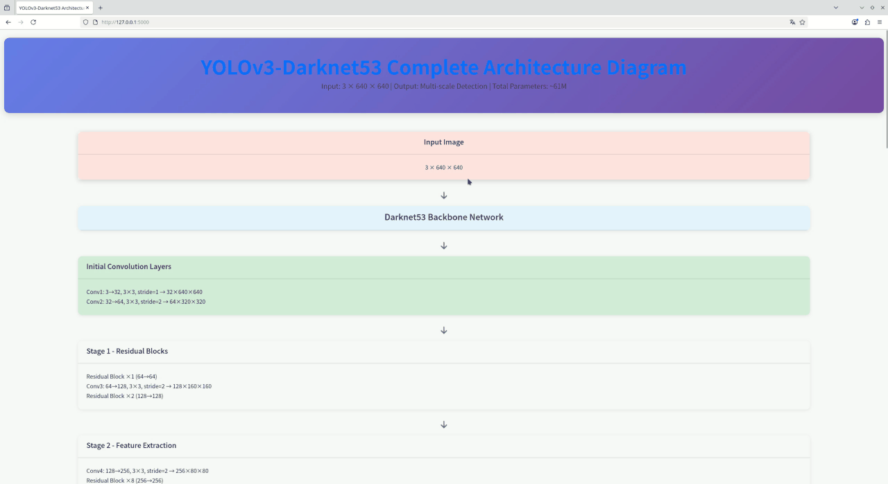

# next 关于YOLO系列论文的复现

这里是属于next的视觉模型与星辰大海之yolo复现仓库，也是属于你们的！

## 程序运行环境的配置

---创建基于anconda的python虚拟环境

    conda create -n next_pytorch python=3.11

---启动创建的python虚拟环境

    conda activate next_pytorch

---配置与安装相关依赖

    pytorch环境配置 

        pip3 install torch torchvision --index-url https://download.pytorch.org/whl/cu126

    ultralytics配置

        pip3 install -i https://pypi.tuna.tsinghua.edu.cn/simple ultralytics

    numpy配置
        
        pip3 install -i https://pypi.tuna.tsinghua.edu.cn/simple numpy==2.1.2
    
    pandas配置

        pip3 install -i https://pypi.tuna.tsinghua.edu.cn/simple pandas==2.3.2

    pillow配置

        pip3 install -i https://pypi.tuna.tsinghua.edu.cn/simple pillow

    matplotlib配置

        pip3 install -i https://pypi.tuna.tsinghua.edu.cn/simple matplotlib

    tqdm配置

        pip3 install -i https://pypi.tuna.tsinghua.edu.cn/simple tqdm==4.67.1

    opencv配置

        pip3 install -i https://pypi.tuna.tsinghua.edu.cn/simple opencv-python
        pip3 install -i https://pypi.tuna.tsinghua.edu.cn/simple opencv-python-headless

    albumentations配置
        
        pip3 install -i https://pypi.tuna.tsinghua.edu.cn/simple albumentations

    sklearn配置

        pip3 install -i https://pypi.tuna.tsinghua.edu.cn/simple scikit-learn==1.7.2
    
    tensorboard配置

        pip3 install -i https://pypi.tuna.tsinghua.edu.cn/simple tensorboard
    
    hiddenlayer与graphviz配置

        pip3 install -i https://pypi.tuna.tsinghua.edu.cn/simple hiddenlayer graphviz

    torchviz配置

        pip3 install -i https://pypi.tuna.tsinghua.edu.cn/simple torchviz

    IPython配置

        pip3 install -i https://pypi.tuna.tsinghua.edu.cn/simple ipython

## V1.0 版本
    
    本人在V1.0版本中只是初步搭建起了YOLOV1与YOLOV3的模型架构与训练过程等，还有许多欠缺与待完善的地方

### *关于在V1.0版本所实现的YOLOV1模型架构解释*

本人在实现YOLOV1时主要使用的架构如下(V1.0版本)

Backbone  --->    resnet18(or resnet34 or resnet50)

Neck    --->    reshape(将resnet架构的输出reshape成yolov1检测头可以接受的尺寸格式)

Head    --->    DetectionNet(仿照原论文自主构建的简化的分类头)

依照Resnet18架构的主干特征提取网络详细的模型架构图如下(resnet34与resnet50的模型架构图与其相似，只是主干特征提取那里稍微加上了几层)

### *关于V1.0版本中YOLOV1损失函数的理解*

    下面我用一个实际的例子来说明一下YOLOV1损失函数计算过程
    首先我们需要知道的是关于YOLO信息存储主要包含五个，分别是：X坐标相对于网格的偏移、Y坐标相对于网格的偏移、宽度相对于图像的比率、高度相对于图像的比率、置信度

    假设场景
        假设我们有一个简单的配置：
            ---图像大小：448x448
            ---网格：7x7
            ---每个网格预测：2个边界框
            ---类别数：20(VOC数据集)
            ---批次大小：2

    示例场景
        假设我们有两个图像：
            图像1：包含一只猫在网格(2, 3)位置
            图像2：包含一只狗在网格(5, 1)位置

    数据表示
        真实标签(a) - 形状（2, 7, 7, 30）
        图像1 - 网格(2, 3)有目标：
        类别one-hot: [0,0,1,0,0,0,0,0,0,0,0,0,0,0,0,0,0,0,0,0]  # 猫是第3类
        边界框1：[0.45, 0.52, 0.3, 0.4, 1]  # (x,y,w,h,confidence)
        边界框2：[0,0,0,0,0]  # 第二个边界框不用

    图像1 - 其他网格：
        类别：[0,0,0,0,0,0,0,0,0,0,0,0,0,0,0,0,0,0,0,0]
        两个边界框：[0,0,0,0,0]

    图像2 - 网格(5, 1)有目标
        类别one-hot: [0,0,0,0,1,0,0,0,0,0,0,0,0,0,0,0,0,0,0,0]  # 狗是第5类
        边界框1：[0.68, 0.25, 0.35, 0.5, 1]
        边界框2：[0,0,0,0,0]

    预测值(p)-形状(2, 7, 7, 30)
        图像1 - 网格(2, 3)的预测
        类别预测：[0.1,0.1,0.6,0.1,0.05,0.02,0.01,0.01,0,0,0,0,0,0,0,0,0,0,0,0]
        边界框1：[0.42, 0.50, 0.28, 0.38, 0.85]  # 预测值接近真实值
        边界框2：[0.55, 0.60, 0.25, 0.35, 0.70]  # 这个框偏离较多

    图像2 - 网格（5, 1）的预测
        类别预测：[0.05,0.05,0.1,0.1,0.65,0.02,0.01,0.01,0,0,0,0,0,0,0,0,0,0,0,0]
        边界框1：[0.65, 0.22, 0.32, 0.45, 0.78]
        边界框2：[0.72, 0.30, 0.40, 0.55, 0.90]  # 这个框IOU更高

        **1、计算IOU和确定负责的边界框**
    
            图像1 - 网格(2, 3):
            
                ---预测框1与真实框IOU = 0.82
                ---预测框2与真实框IOU = 0.45
                ---预测框1负责（IOU更大）
        
            图像2 - 网格(5, 1):
        
                ---预测框1与真实框IOU = 0.75
                ---预测框2与真实框IOU = 0.88
                ---预测框2负责（IOU更大）
    
        **2、创建掩码**
        
        obj_ij(有目标且负责)：
        
            ---图像1网格（2, 3）：[1, 0] # 第一个边界框负责
            ---图像2网格（5, 1）：[0, 1] # 第二个边界框负责
            ---其他网格：[0, 0]
        
        noobj_ij(无目标或不负责)：
        
            ---图像1网格(2, 3):[0, 1] # 第二个边界框不负责
            ---图像2网格(5, 1):[1, 0] # 第一个边界框不负责
            ---其他网格：[1, 1] # 两个边界框都无目标
    
        **3、各项损失计算**
        
        坐标损失(权重=5)
        
            图像1网格（2, 3）框1：
                x: (0.42 - 0.45)² = 0.0009
                y: (0.50 -0.52)² = 0.0004
        
            图像2网格(5, 1)框2：
                x: (0.72 - 0.68)² = 0.0016
                y: (0.30 - 0.25)² = 0.0025
        
            总坐标损失 = 0.0009 + 0.0004 + 0.0016 + 0.0025 = 0.0054
            加权坐标损失 = 5 x 0.0054 = 0.027
        
        尺寸损失 - 使用平方根（权重=5）
        
            图像1网格（2, 3）框1：
                w: (sqrt(0.28) - sqrt(0.3))² = (0.529 - 0.548)² = 0.00036
                h: (sqrt(0.38) - sqrt(0.4))² = (0.616 - 0.632)² = 0.00026
        
            图像2网格(5, 1)框2：
                w: (sqrt(0.4) - sqrt(0.35))² = (0.632 - 0.592)² = 0.0016
                h: (sqrt(0.55) - sqrt(0.5))² = (0.742 - 0.707)² = 0.0012
        
            总尺寸损失 = 0.00036 + 0.00026 + 0.0016 + 0.0012 = 0.00342
            加权尺寸损失 = 5 × 0.00342 = 0.0171
        
        置信度损失
            
            有目标位置
                图像1网格(2,3)框1: (0.85 - 1)² = 0.0225
                图像2网格(5,1)框2: (0.90 - 1)² = 0.01
                有目标置信度损失 = 0.0225 + 0.01 = 0.0325
            
            无目标位置
                图像1网格(2,3)框2: (0.70 - 0)² = 0.49
                图像2网格(5,1)框1: (0.78 - 0)² = 0.6084
                其他138个无目标网格（7×7×2 - 2 = 96个位置）：平均每个置信度0.1
                无目标置信度损失 ≈ 0.49 + 0.6084 + 96×0.01 = 2.5584
                加权无目标置信度损失 = 0.5 × 2.5584 = 1.2792
        
        类别损失
        
            图像1网格(2,3): 
              (0.1-0)² + (0.1-0)² + (0.6-1)² + ... (共20项) ≈ 0.35
            
            图像2网格(5,1):
              (0.05-0)² + (0.05-0)² + (0.1-0)² + (0.1-0)² + (0.65-1)² + ... ≈ 0.28
            
            类别损失 = 0.35 + 0.28 = 0.63
        
        总损失
        
            总损失 = 坐标损失 + 尺寸损失 + 有目标置信度 + 无目标置信度 + 类别损失
              = 0.027 + 0.0171 + 0.0325 + 1.2792 + 0.63
              = 1.9858
        
            批次平均损失 = 1.9858 / 2 = 0.9929

### *关于V1.0版本中YOLOV3模型架构的解释*
    
关于本人在V1.0版本实现的YOLOV3架构图的详细解释可见下图:

### *关于在V1.0版本所实现的YOLOV3损失函数的理解*

## V1.1 版本

    本人在V1.1版本中只是初步搭建起了YOLOV2、YOLOV4与YOLOV5的模型架构与训练过程等，同时还具有很多待完善和处理的地方

### *关于在V1.1版本所实现的YOLOV2模型架构的解释*

### *关于在V1.1版本所实现的YOLOV2损失函数的理解*

### *关于在V1.1版本所实现的YOLOV4模型架构的解释*

### *关于在V1.1版本所实现的YOLOV4损失函数的理解*

### *关于在V1.1版本所实现的YOLOV5模型架构的解释*

### *关于在V1.1版本所实现的YOLOV5损失函数的理解*
